# GitNexus — Deep Wiki

> Documentação completa da arquitetura e funcionamento do GitNexus, um motor de inteligência de código que transforma repositórios em grafos de conhecimento navegáveis por agentes de IA.

---

## Visão Geral

O **GitNexus** é uma plataforma de **Code Intelligence** que analisa repositórios de código-fonte e constrói um **grafo de conhecimento** (Knowledge Graph) contendo símbolos (funções, classes, métodos, variáveis), seus relacionamentos (chamadas, importações, herança) e fluxos de execução (processos). Esse grafo é então exposto via **MCP (Model Context Protocol)** para que assistentes de IA como Claude Code, Cursor e outros possam navegar e entender codebases de forma estruturada.

### O que ele resolve

Assistentes de IA precisam entender código para ajudar desenvolvedores. Sem o GitNexus, eles fazem `grep` e lêem arquivos — uma abordagem limitada. Com o GitNexus, eles consultam um grafo tipado com relações semânticas, fluxos de execução e análise de impacto.

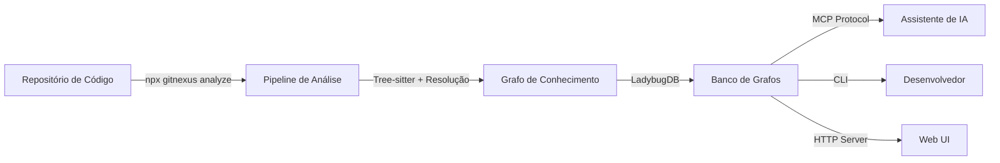

---

## Arquitetura de Alto Nível

```mermaid
graph TB
    subgraph "Camada de Interface"
        CLI[CLI - Commander.js]
        MCP[MCP Server - stdio]
        HTTP[HTTP Server - Express]
        EVAL[Eval Server - SWE-bench]
    end

    subgraph "Camada de Aplicação"
        TOOLS[Tools Layer<br/>query, context, impact,<br/>detect_changes, rename, cypher]
        WIKI[Wiki Generator<br/>Documentação LLM]
        AUG[Augmentation Engine<br/>Hook de contexto IDE]
        AICTX[AI Context Generator<br/>Skill files .claude/]
    end

    subgraph "Camada de Core"
        PIPE[Pipeline de Ingestão<br/>10 fases]
        SEARCH[Hybrid Search<br/>BM25 + Embeddings]
        GRAPH[In-Memory Graph<br/>Dual-Map O(1)]
    end

    subgraph "Camada de Persistência"
        LBUG[LadybugDB<br/>Grafo + FTS + Embeddings]
        REG[Registry<br/>~/.gitnexus/registry.json]
        LOCAL[.gitnexus/<br/>lbug, meta.json, csv/]
    end

    CLI --> TOOLS
    MCP --> TOOLS
    HTTP --> TOOLS
    EVAL --> TOOLS
    CLI --> WIKI
    CLI --> AUG

    TOOLS --> SEARCH
    TOOLS --> LBUG
    WIKI --> LBUG
    AUG --> SEARCH

    PIPE --> GRAPH
    GRAPH --> LBUG
    SEARCH --> LBUG
    LBUG --> LOCAL
    LBUG --> REG
```

---

## Pipeline de Ingestão — O Coração do Sistema

O pipeline de análise é o componente mais crítico. Ele processa o repositório em **10 fases sequenciais**, cada uma construindo sobre a anterior:

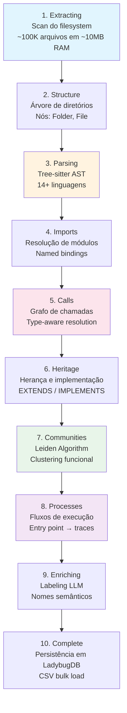

### Gestão de Memória

O pipeline usa **chunked processing** com budget de 20MB por chunk para manter o pico de memória entre 200-400MB, mesmo em repositórios com 100K+ arquivos. Um cache LRU de ASTs é limpo entre chunks.

---

## Modelo de Dados — O Grafo

### Tipos de Nó (22 tipos)

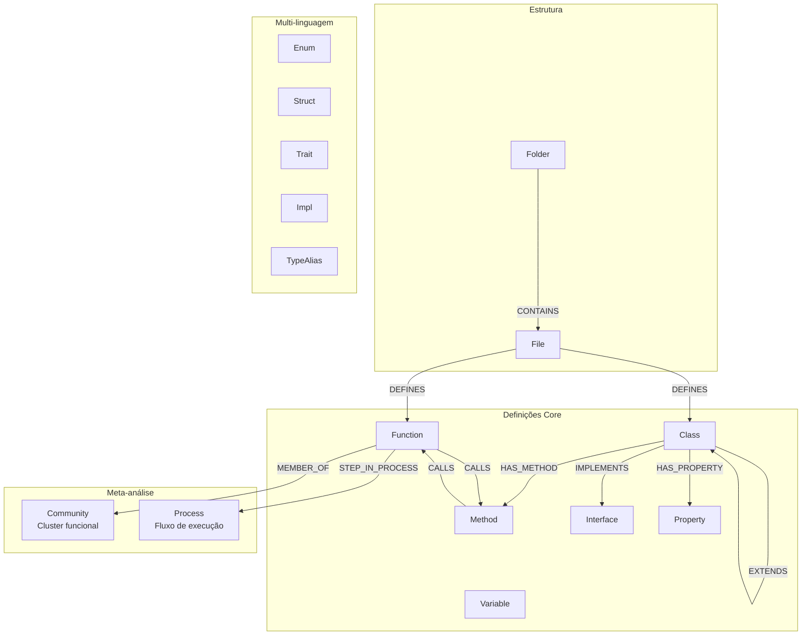

### Tipos de Relacionamento (14 tipos)

| Relacionamento | Significado | Exemplo |
|---|---|---|
| `CONTAINS` | Hierarquia de diretórios | `src/` → `auth.ts` |
| `DEFINES` | Arquivo define símbolo | `auth.ts` → `validateUser()` |
| `IMPORTS` | Importação de módulo | `login.ts` → `auth.ts` |
| `CALLS` | Chamada de função/método | `login()` → `validateUser()` |
| `EXTENDS` | Herança de classe | `Admin` → `User` |
| `IMPLEMENTS` | Implementação de interface | `UserService` → `IService` |
| `HAS_METHOD` | Classe contém método | `UserService` → `getUser()` |
| `HAS_PROPERTY` | Classe contém propriedade | `User` → `email` |
| `OVERRIDES` | Sobrescrita de método (MRO) | `Admin.save()` → `User.save()` |
| `ACCESSES` | Acesso a propriedade | `fn()` → `user.name` |
| `MEMBER_OF` | Pertence a comunidade | `validateUser()` → `AuthCluster` |
| `STEP_IN_PROCESS` | Passo em fluxo de execução | `login()` → `AuthFlow` |

Cada relacionamento carrega um **confidence score** (0-1) e um **resolution tier** indicando como foi resolvido.

---

## Resolução de Símbolos — Como Chamadas São Conectadas

O sistema usa resolução em 4 tiers, do mais confiável ao menos:

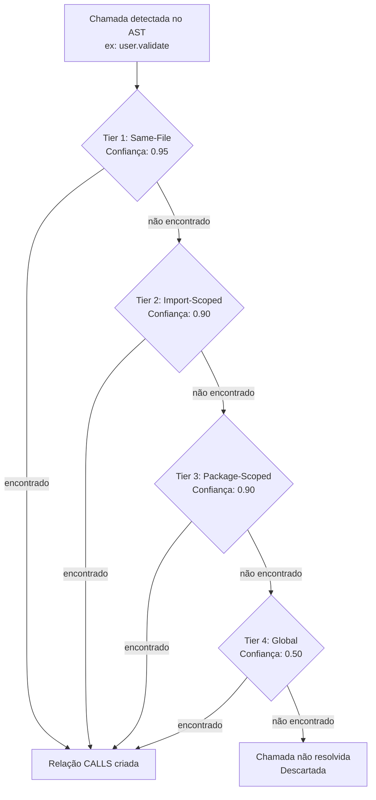

### Type Environment (TypeEnv)

Para resolver chamadas de método em receptores (ex: `user.validate()`), o sistema mantém um **TypeEnv** por arquivo com 3 tiers de inferência de tipo:

| Tier | Fonte | Exemplo |
|---|---|---|
| Tier 0 | Anotação de tipo | `const x: User = ...` |
| Tier 1 | Inferência de construtor | `const x = new User()` |
| Tier 2 | Propagação de atribuição | `const x = y` onde `y: User` |

---

## Linguagens Suportadas (14+)

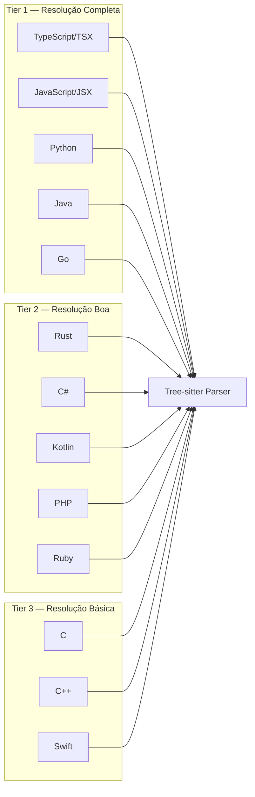

Cada linguagem tem:
- **Queries Tree-sitter** específicas para extração de definições, chamadas, imports e herança
- **Type Extractors** para inferência de tipos (anotações, generics, Option/Result unwrap)
- **Import Resolvers** que entendem o sistema de módulos da linguagem (go.mod, tsconfig paths, PSR-4, etc.)
- **Export Detection** com regras da linguagem (Go: letra maiúscula, Python: sem `_` prefixo, etc.)

---

## Detecção de Comunidades (Clusters)

O sistema usa o **algoritmo de Leiden** (evolução do Louvain) sobre o grafo de CALLS para detectar automaticamente módulos funcionais:

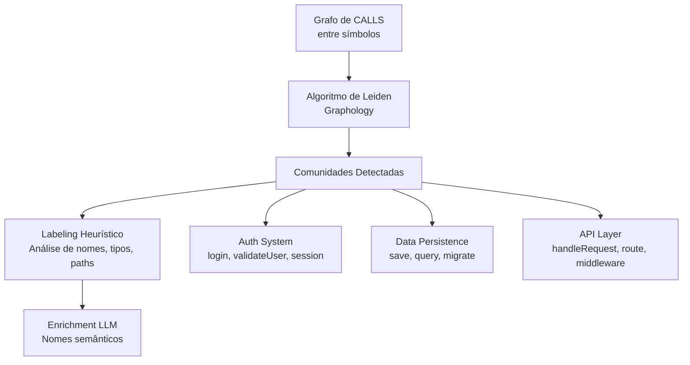

**Saída**: Comunidades com label semântico, score de coesão e contagem de membros.

---

## Detecção de Processos (Fluxos de Execução)

Processos são **caminhos no grafo de CALLS** que representam fluxos end-to-end:

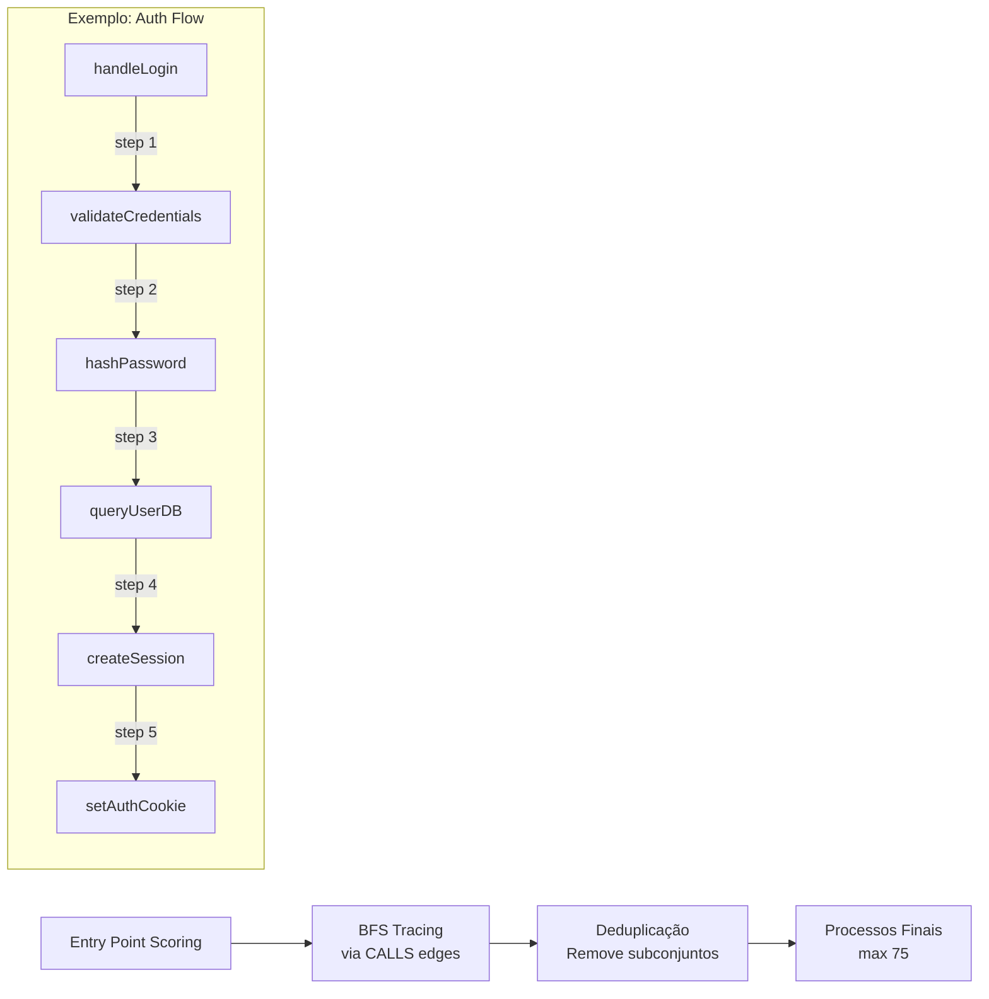

### Scoring de Entry Points

| Fator | Peso | Exemplo |
|---|---|---|
| Call Ratio (callees/callers) | Alto | Muitas saídas, poucas entradas |
| Export Status | +0.5 | Funções exportadas |
| Name Patterns | Variável | `handle*`, `on*`, `*Controller` |
| Framework Detection | 2.5-3.0x | Next.js pages, Express routes, Django views |

---

## MCP Server — Interface para IA

O MCP Server expõe o grafo via protocolo JSON-RPC stdio com 7 tools e 10+ resources:

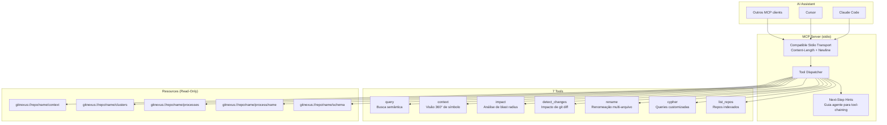

### Análise de Impacto — O Recurso Mais Poderoso

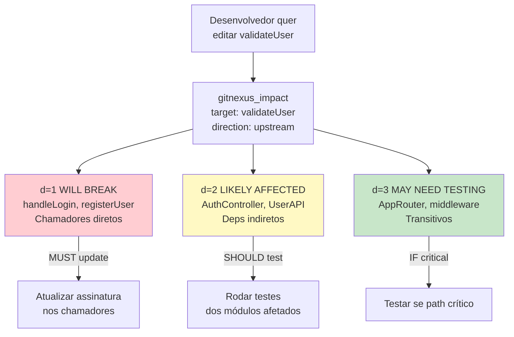

---

## Busca Híbrida

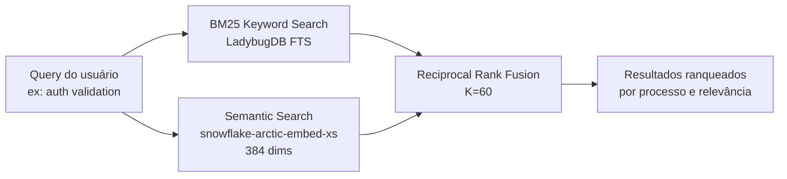

- **BM25**: Sempre disponível via Full-Text Search do LadybugDB
- **Embeddings**: Opcional, usa modelo `snowflake-arctic-embed-xs` (22M params, ~90MB)
- **Fusão**: RRF combina rankings com fórmula `1/(K + rank + 1)`

---

## Persistência — LadybugDB

```mermaid
graph TB
    subgraph "In-Memory Graph"
        NODES[Node Map<br/>O(1) lookup]
        RELS[Relationship Map<br/>O(1) lookup]
    end

    subgraph "CSV Serialization"
        CSV1[nodes.csv]
        CSV2[relationships.csv]
    end

    subgraph "LadybugDB"
        NTABLES[22 Node Tables<br/>File, Function, Class...]
        RTABLE[CodeRelation Table<br/>Todas as relações]
        ETABLE[CodeEmbedding Table<br/>Vetores 384-dim]
        FTS[Full-Text Search Index]
        VEC[Vector Index<br/>Busca semântica]
    end

    NODES --> CSV1
    RELS --> CSV2
    CSV1 -->|COPY| NTABLES
    CSV2 -->|COPY| RTABLE

    subgraph "Otimizações"
        POOL[Connection Pool<br/>8 max por repo]
        LRU[LRU Eviction<br/>5 repos max]
        IDLE[Idle Timeout<br/>5 min]
        LOCK[Session Locking<br/>Anti-race condition]
    end
```

---

## Wiki Generator

Pipeline de 4 fases para gerar documentação automática com LLM:

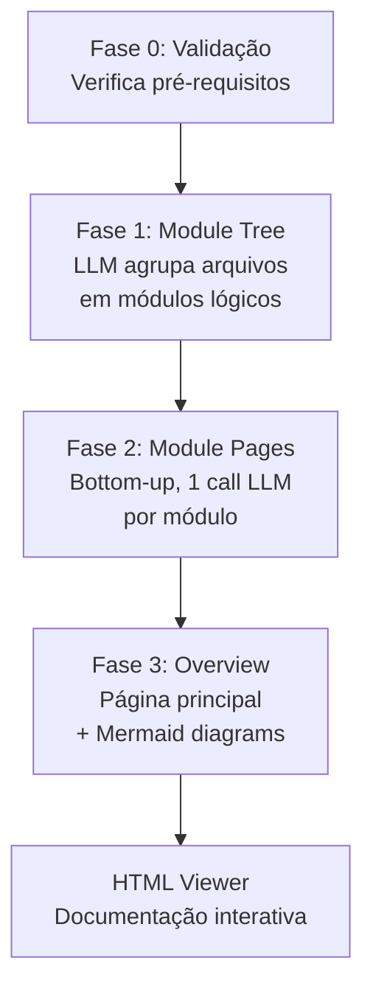

---

## Augmentation Engine — Contexto para IDE Hooks

Motor leve (<500ms) que enriquece ferramentas de IA com contexto do grafo:

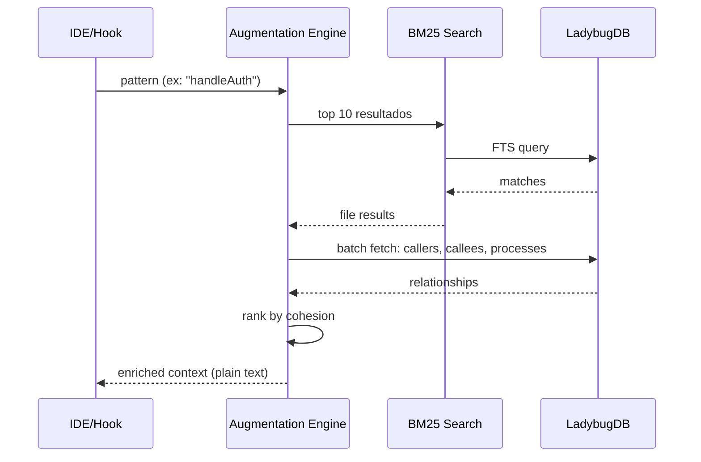

---

## CLI — 12 Comandos

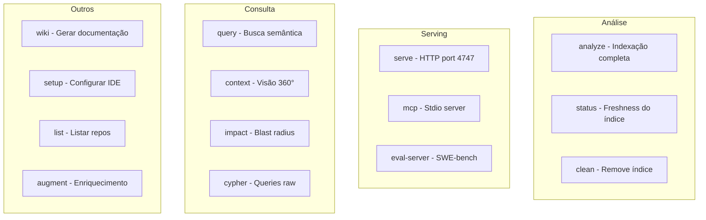

---

## Fluxo Completo — Do Repositório à Resposta do Agente

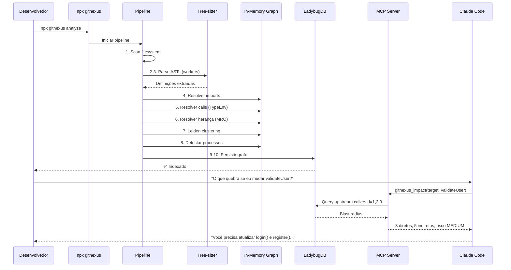

---

## Stack Tecnológica

| Camada | Tecnologia |
|---|---|
| **Linguagem** | TypeScript (ES2020, CommonJS) |
| **Parsing** | Tree-sitter (14+ linguagens via WASM/native) |
| **Grafo** | Graphology (in-memory) + LadybugDB (persistência) |
| **Embeddings** | @huggingface/transformers (snowflake-arctic-embed-xs) |
| **CLI** | Commander.js |
| **HTTP** | Express.js |
| **MCP** | @modelcontextprotocol/sdk |
| **Clustering** | Leiden Algorithm (vendored) |
| **Testes** | Vitest |
| **Build** | tsc (TypeScript compiler) |

---

## Métricas do Projeto

- **~99 arquivos TypeScript**, ~1.4MB de código-fonte
- **2075 símbolos** indexados, **4935 relacionamentos**, **157 fluxos de execução**
- **14+ linguagens** suportadas via Tree-sitter
- **22 tipos de nó**, **14 tipos de relacionamento**
- **7 MCP tools**, **10+ MCP resources**
- **12 comandos CLI**
- Processamento de repositórios com **100K+ arquivos** em memória limitada (~400MB pico)

---

## Resumo Funcional

O GitNexus é essencialmente um **compilador de conhecimento sobre código**. Ele:

1. **Lê** o código-fonte usando Tree-sitter (parsing multi-linguagem)
2. **Entende** as relações entre símbolos (imports, chamadas, herança, tipos)
3. **Agrupa** código em módulos funcionais (Leiden clustering)
4. **Traça** fluxos de execução end-to-end (process detection)
5. **Persiste** tudo em um banco de grafos (LadybugDB)
6. **Expõe** esse conhecimento para agentes de IA via MCP

O resultado é que um agente de IA pode perguntar "o que quebra se eu mudar X?" e receber uma resposta precisa baseada em análise estática real do grafo de dependências — não em heurísticas ou grep.
